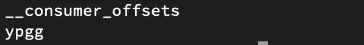
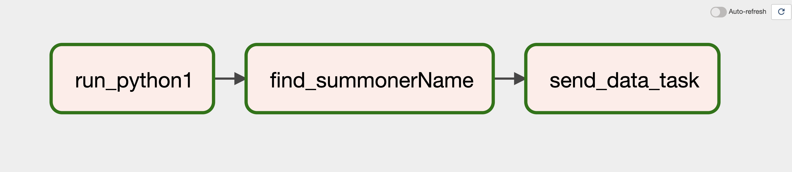
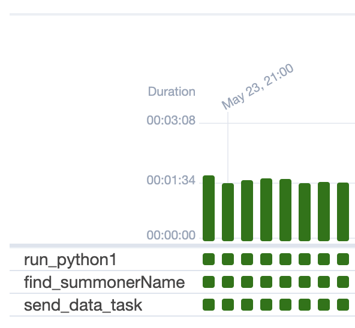

# Airflow를 이용하여 Kafka Producer 배치 작업
## 1. Kakfa
### 1.1 Kafka topic 생성
ypgg라는 topic을 생성
```bash
$ kafka-topics --create --topic ypgg --partitions 3 --replication-factor 3  --bootstrap-server broker1:29092
```
### 1.2 Kafka topic list 확인
docker를 사용하므로 broker1 컨테이너에 접속하여 topic 생성이 되었는지 list 확인
```bash
$ docker exec -it broker1 bash
$ kafka-topics --list --bootstrap-server localhost:9092
```
<p align="left">

</p>

### 1.3 Kafka Producer 개발
- find_userName : 각 티어별 유저들의 SummonerName List를 만드는 함수
- send_data_to_kafka : 유저의 게임 History Data를 파싱하고 Kafka topic으로 전달하는 Producer
```python
def find_userName(queueType, page):
    userList = riotApi.allTierUsersId(queueType, page)
    return userList


def send_data_to_kafka(**kwargs):
    ti = kwargs['ti']
    userList = ti.xcom_pull(task_ids='find_summonerName')
    #riotApi = RiotMatchData()
    
    producer = KafkaProducer(
        acks=0, 
        compression_type='gzip', 
        bootstrap_servers=['broker1:29092'], 
        value_serializer=lambda x: dumps(x).encode('utf-8')
    )
    
    start = 0
    count = 5
    
    matchRecordData = riotApi.matchDataInfo(userList, start, count)
    print('DATA : ' , matchRecordData)
    
    for data in matchRecordData:  
        recordData_ = data
        producer.send('ypgg',value=recordData_)
        producer.flush()
    #producer.close()
    print("DONE")
```
## 2. Airflow
### 2.1 Airflow DAG를 이용한 배치 작업 실행
주기적으로 Riot API에 요청을 보내고 파싱을 하여 Kafka topic에 전달하는 역할을 Airflow를 이용하여 배치 실횅
```python
default_args = {
    'start_date': datetime(2023, 5, 15)
}
    
with DAG(
    dag_id='riot_pipeline',
    schedule_interval='*/10 * * * *',
    catchup=False,
    default_args=default_args
) as dag:    
    find_summonerName = PythonOperator(
        task_id = 'find_summonerName',
        python_callable=find_userName,
        op_kwargs={'queueType': 'RANKED_SOLO_5x5', 'page': 1},
        provide_context=True,
        dag=dag
    )
    
    send_data_task = PythonOperator(
        task_id='send_data_task',
        python_callable=send_data_to_kafka,
        dag=dag
    )
    
    find_summonerName >> send_data_task
```

### 2.2 Airflow-webserver를 이용한 배치 작업 실행 및 모니터링
- Airflow task Graph 확인
<p align="left">

</p>

- Airflow task Grid 확인
<p align="left">

</p>
