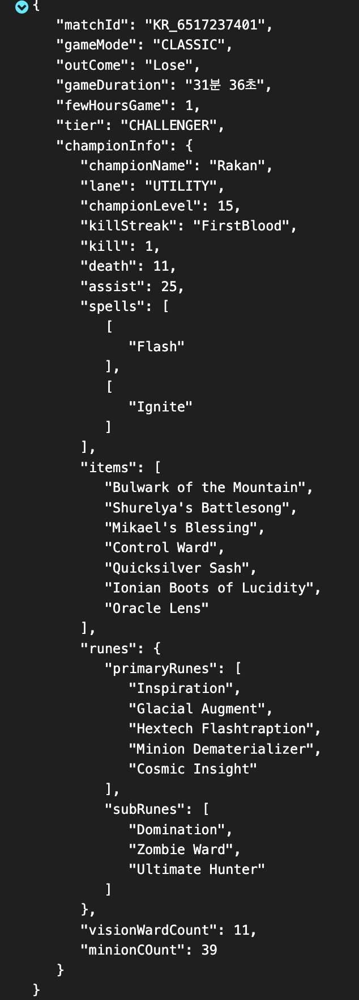

# History Data Parsing
## matchDataInfo Function 
### 1. item, spell, rune 게임 버전 별 Json 파일 변경
item, spell, rune 데이터는 암호화된 데이터로 리턴 받습니다. 해당 아이템, 스펠, 룬의 이름을 알기위해 Riot에서 제공하는 각각의 Json 파일 Url을 
게임 버전에 맞게 가져와야 합니다.

```python
# 게임버전
gameVersion = historyData['info']['gameVersion'][:5] + '.1'

# Item, Spell, Runes URL
items_url = f'https://ddragon.leagueoflegends.com/cdn/{gameVersion}/data/en_US/item.json'
spell_url = f'https://ddragon.leagueoflegends.com/cdn/{gameVersion}/data/en_US/summoner.json'      
runes_url = f'https://ddragon.leagueoflegends.com/cdn/{gameVersion}/data/en_US/runesReforged.json'
        
```
### 2. 필요한 정보만 종합하여 새로운 Json 파일 생성
Riot API를 통해 얻은 Json 파일에는 많은 정보 중에서 필요한 정보만 종합하여 Kafka topic에 전달하기 위한
새로운 Json 형식의 파일을 생성합니다.

```python
# 매치정보 return json 파일
matchDataJson = OrderedDict()
matchDataJson["matchId"] = match
matchDataJson["gameMode"] = gameMode
matchDataJson["outCome"] = stringVictory
matchDataJson["gameDuration"] = gameDuration
matchDataJson["fewHoursGame"] = fewHoursGame
matchDataJson['tier'] = tier

matchDataJson["championInfo"] = {'championName': championName,
                             'lane': lane,
                            'championLevel': champLevel,
                            'killStreak': maxKill,
                            'kill': kills,
                            'death': deaths,
                            'assist': assists,
                            'spells': champSpell,
                            'items': items,
                            'runes': {'primaryRunes': primaryRunesNameList,
                                    'subRunes':subRunesNameList},
                            'visionWardCount': visionWardsCount,
                            'minionCOunt': CsCount
                            }

result = json.dumps(matchDataJson, ensure_ascii=False, indent=4)
jsonDatas_.append(json.loads(result))
```
<p align="left">

</p>
