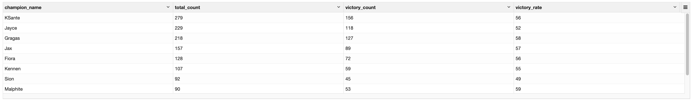
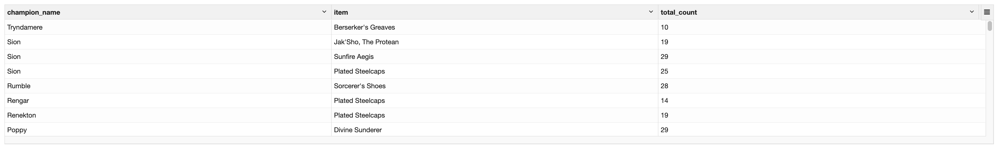

# PySpark.sql
## 1. Spark를 이용한 데이터 분석
### 1.1 TempView 생성
- pyspark.sql 사용을 위한 TempView를 생성
- GameMode는 ARM 과 CLASSIC 두가지의 데이터가 종합으로 수집되므로 CLASSIC 데이터만 필터링
- 중복이 되는 경우가 발생할 수 있으므로 중복 제거
```python
df_all_lol_warehouse.filter(df_all_lol_warehouse.gameMode == "CLASSIC") \
                    .dropDuplicates() \
                    .createOrReplaceTempView("lol_agg_table")
```
### 1.2 라인 별 챔피언 픽 횟수 및 승률
- JOIN 과 서브쿼리를 사용
```python
from pyspark.sql.functions import round

top = spark.sql("""
    SELECT l.champion_name,  l.total_count AS total_count, v.victory_count AS victory_count, CAST(ROUND((v.victory_count / l.total_count) * 100) AS INTEGER) AS victory_rate
    FROM (
        SELECT champion_name, COUNT(champion_name) AS total_count
        FROM lol_agg_table
        WHERE lane = 'TOP'
        GROUP BY champion_name
    ) l
    JOIN (
        SELECT champion_name, COUNT(champion_name) AS victory_count
        FROM lol_agg_table
        WHERE lane = 'TOP' AND outCome = 'Victory'
        GROUP BY champion_name
    ) v
    ON l.champion_name = v.champion_name
    ORDER BY total_count desc
    LIMIT 10
""")
```
<p align="left">

</p>

### 1.3 챔피언 별 선호하는 아이템 
- 아이템은 items_1 ~ items_7 컬럼에 있기 때문에 각각의 카운트를 한 테이블을 모두 조인하여 카운트를 종합하여 챔피언 별 선호하는 아이템 데이터를 추출
```python
from pyspark.sql import functions as F

# items_1에 대한 count
items_1 = spark.sql("""
    SELECT champion_name, items_1 AS item, count(items_1) AS count
    FROM lol_agg_table
    WHERE lane = 'TOP' and outCome = 'Victory'
    GROUP BY champion_name, items_1
""")
.
.
.
# items_6에 대한 count
items_6 = spark.sql("""
    SELECT champion_name, items_6 AS item, count(items_6) AS count
    FROM lol_agg_table
    WHERE lane = 'TOP' and outCome = 'Victory'
    GROUP BY champion_name, items_6
""")

# 조인 및 합산
joined_items = items_1.join(items_2, ['champion_name', 'item'], 'inner') \
    .join(items_3, ['champion_name', 'item'], 'inner') \
    .join(items_4, ['champion_name', 'item'], 'inner') \
    .join(items_5, ['champion_name', 'item'], 'inner') \
    .join(items_6, ['champion_name', 'item'], 'inner') \
    .select(items_1['champion_name'], items_1['item'], (items_1['count'] + items_2['count'] + items_3['count'] + items_4['count'] + items_5['count'] + items_6['count']).alias('total_count')) \
    .orderBy(F.desc('champion_name'))
```
<p align="left">

</p>
