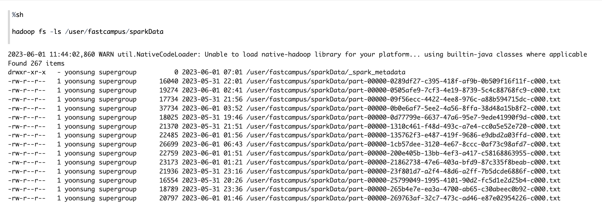
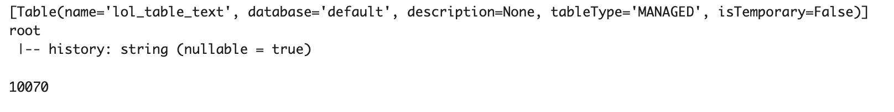

# Spark
## 1. Spark를 이용한 데이터 분석
### 1.1 TempView 생성
- pyspark.sql 사용을 위한 TempView를 생성
- GameMode는 ARM 과 CLASSIC 두가지의 데이터가 종합으로 수집되므로 CLASSIC 데이터만 필터링
- 중복이 되는 경우가 발생할 수 있으므로 중복 제거
```python
df_all_lol_warehouse.filter(df_all_lol_warehouse.gameMode == "CLASSIC") \
                    .dropDuplicates() \
                    .createOrReplaceTempView("lol_agg_table")
```
### 1.2 라인 별 챔피언 픽 횟수 및 승률
- JOIN 과 서브쿼리를 사용
```python
from pyspark.sql.functions import round

top = spark.sql("""
    SELECT l.champion_name,  l.total_count AS total_count, v.victory_count AS victory_count, CAST(ROUND((v.victory_count / l.total_count) * 100) AS INTEGER) AS victory_rate
    FROM (
        SELECT champion_name, COUNT(champion_name) AS total_count
        FROM lol_agg_table
        WHERE lane = 'TOP'
        GROUP BY champion_name
    ) l
    JOIN (
        SELECT champion_name, COUNT(champion_name) AS victory_count
        FROM lol_agg_table
        WHERE lane = 'TOP' AND outCome = 'Victory'
        GROUP BY champion_name
    ) v
    ON l.champion_name = v.champion_name
    ORDER BY total_count desc
    LIMIT 10
""")
```
<p align="left">

</p>

### 1.3 Spark-Warehouse에 저장
- 작업을 5초마다 실행하도록 트리거링
- "append"로 설정하여 기존 테이블에 새로운 데이터를 추가
- 체크포인트 위치를 지정
- 데이터를 테이블로 저장할 이름을 지정
```python
from pyspark.sql.streaming import DataStreamWriter

query_df_stream_lol_table_text = df_stream_lol \
    .writeStream \
    .trigger(processingTime = '5 seconds') \
    .outputMode("append") \
    .option("checkpointLocation", "/user/fastcampus/checkpoint/structured_streaming/lol_table_text") \
    .queryName("query_df_stream_lol_table_text") \
    .toTable("lol_table_text")
```
<p align="left">

</p>

### 1.4 Warehouse 저장 확인
```python
print(spark.catalog.listTables())
spark.table("lol_table_text").printSchema()
spark.catalog.refreshTable("lol_table_text")
print(spark.table("lol_table_text").count())
```
<p align="left">

</p>
