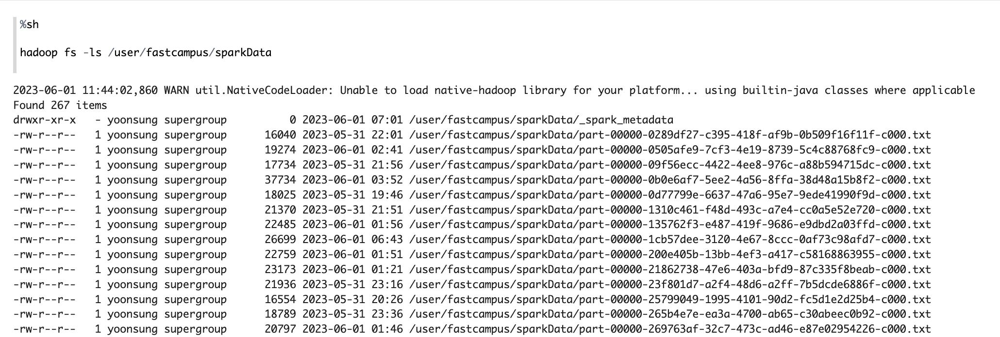
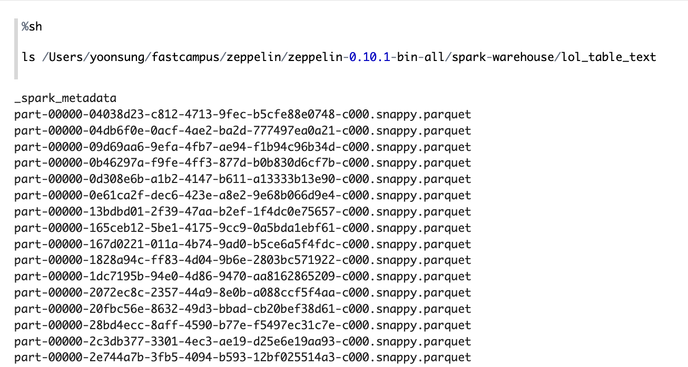
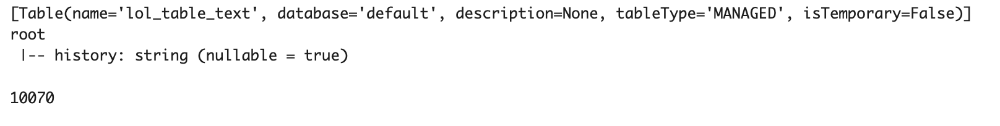

# Spark Streaming
## 1. Spark를 이용한 데이터 저장
### 1.1 데이터 읽어오기
- PySpark를 사용하여 Kafka에서 external listener을 이용해서 로컬에 설치된 스파크 스트리밍으로  데이터를 읽어온다.
- Kafka에서 읽어온 데이터의 Value 값만 가져온다.
- null 값과 빈 문자열을 필터링하여 "history" 열로 구성된 DataFrame을 생성한다.
```python
from pyspark.sql import SparkSession
spark = SparkSession.builder \
    .appName("KafkaConsumer") \
    .getOrCreate()

spark.sparkContext.setLogLevel('ERROR')


lol = spark \
    .readStream \
    .format("kafka") \
    .option("kafka.bootstrap.servers", "localhost:9092") \
    .option("subscribe", "ypgg") \
    .option("startingOffsets", "earliest") \
    .load()

# Value 값만 가져오기
lol_value = lol.selectExpr("CAST(key AS STRING)", "CAST(value AS STRING)") \
                .select("value")

# null 값 필터링 데이터
df_stream_lol = lol_value \
.filter("value is not null") \
.filter("value <> ''") \
.toDF("history")
```
### 1.2 HDFS에 text 포맷으로 저장
- 작업을 5초마다 실행하도록 트리거링
- "append"로 설정하여 기존 데이터에 새로운 데이터를 추가
- 출력 형식을 텍스트 형식으로 설정
- 체크포인트 위치를 지정
- 데이터를 저장할 경로 지정
```python
from pyspark.sql.streaming import DataStreamWriter

# Write stream - HDFS
query_df_stream_lol_hdfs_text = df_stream_lol.selectExpr("CAST(history AS STRING)") \
.writeStream \
.trigger(processingTime = '5 seconds') \
.outputMode("append") \
.format("text") \
.option("checkpointLocation", "/user/fastcampus/checkpoint/structured_streaming/lol_hdfs_text") \
.option("path","/user/fastcampus/sparkData") \
.option("encoding", "utf-8") \
.queryName("query_df_stream_lol_hdfs_text") \
.start()
```
<p align="left">

</p>

### 1.3 Spark-Warehouse에 저장
- 작업을 5초마다 실행하도록 트리거링
- "append"로 설정하여 기존 테이블에 새로운 데이터를 추가
- 체크포인트 위치를 지정
- 데이터를 테이블로 저장할 이름을 지정
```python
from pyspark.sql.streaming import DataStreamWriter

query_df_stream_lol_table_text = df_stream_lol \
    .writeStream \
    .trigger(processingTime = '5 seconds') \
    .outputMode("append") \
    .option("checkpointLocation", "/user/fastcampus/checkpoint/structured_streaming/lol_table_text") \
    .queryName("query_df_stream_lol_table_text") \
    .toTable("lol_table_text")
```
<p align="left">

</p>

### 1.4 Warehouse 저장 확인
```python
print(spark.catalog.listTables())
spark.table("lol_table_text").printSchema()
spark.catalog.refreshTable("lol_table_text")
print(spark.table("lol_table_text").count())
```
<p align="left">

</p>
